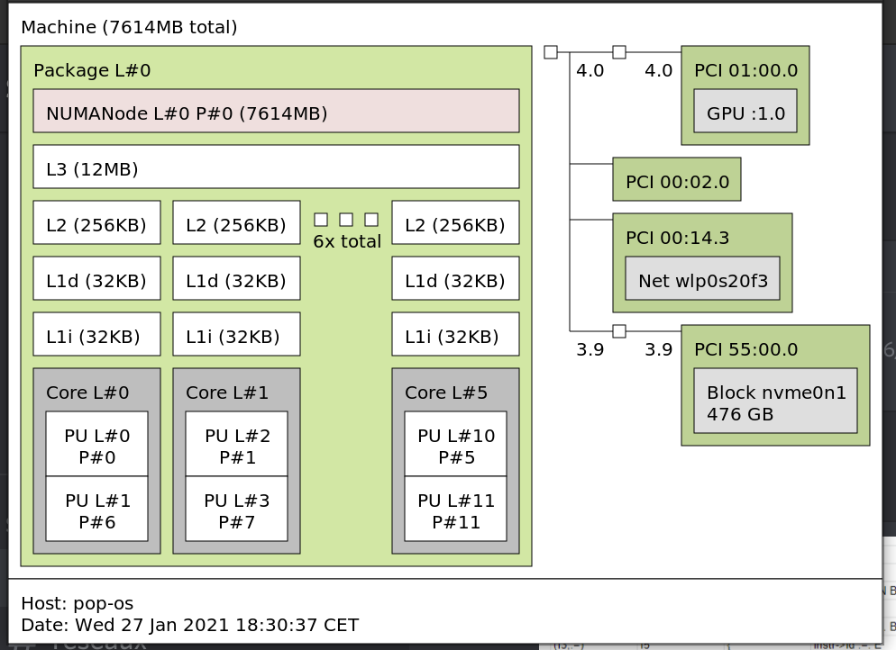
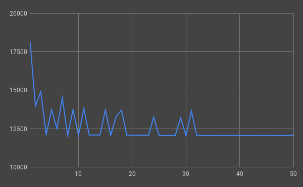
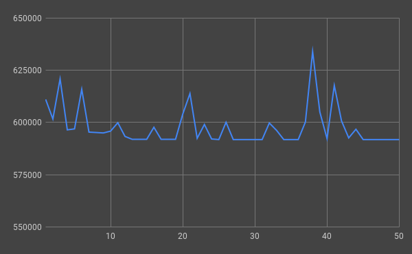
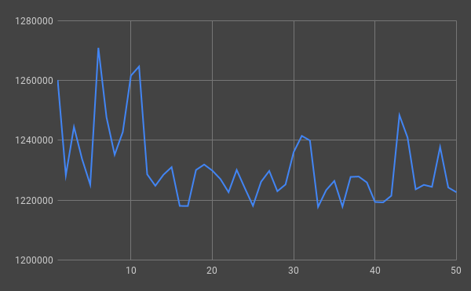

# Introduction

## Présentation du sujet

Nous avons travaillé sur le sujet 13.

Celui ci consiste à  

## Fonction à optimiser :

```c
  void s13 (unsigned n , const float a[n] ,const float b[n] , float c[n][n] ,int offset , double radius) {
     int i, j;

     for ( i = 0; i < n ; i ++) {
       for ( j = 0; j < n ; j ++) {
           if ( offset + j < 0 || offset + j >= n )
              continue;

           c [ i ][ offset + j ] = 0.0;

           if ( a[offset + j] < radius ) {
              c [ i ][ offset + j ] = a [ offset + j ] / b [ i ];
           }
        }
     }
  }
```

## I Méthodologie

### I.1) Justification des 5 points clés du driver (warmups, repets etc.)

De nombreux obstacles rentrent en compte quant à la précision des mesures :

- Précision du timer
- RDTSC : précis à quelques cycles près mais biais de 20-30 cycles (amorti à partir de ~500 cycles)
- Compteurs matériels : plusieurs secondes nécessaires
- Etat initial de la machine
- Régime transitoire : C-states/DVFS, caches et prefetchers “froids”, pipeline non rempli
- Stabilité (variation d'une mesure à l'autre)
- Pollution par système et autres applis

#### Les solutions suivantes permettent de palier à ces obstacles et d'obtenir des mesures fiables et exploitables :

##### <u>Répétitions du noyau</u>

Communnément appelés "warmup" ces répétitions viennent en amont des mesures afin de préparer le système aux mesures.

Elles permettent d'exclure le régime transitoire. Elles sont d'autant plus importantes lorsque la machine est froide.

Lors des mesures ces répétitions amortissent l'erreur du timer.

##### <u>Méta-répétitions pour mesurer la stabilité</u>

- Répétitions du corps du driver
- Via un script ou une boucle dans le driver
- En toute rigueur, 31 méta-répétitions nécessaires
- Souhaité : (médiane - minimum) / minimum < 5 % = 31

##### <u>Environnement d'exécution le plus léger possible</u>

En ayant un environnement d'exécution sain, meilleures seront les mesures. Il n'y aura pas/moins de bruit dû à d'autres processus. Il est donc préférable d'exécuter son OS en mode console ou de suspendre un maximum de processus en tache de fond.

Une autre des solutions est de choisir un coeur sur lequel exécuter les mesures (process pinning). De ce fait aucun autre processus ne pourra venir interragir avec celui-ci. (taskset -c / Appel POSIX)

#### Optimisation du code

Il existe de nombreuses méthodes afin d'optimiser le code.

- If hoisting
- loop tilling / unrolling
- loop pilling
- loop fusion / fission
- loop interchange

### I.2) Stratégies utilisées en commun pour améliorer la stabilité

#### Optimisation de la compilation
`gcc` propose plusieurs "flags" de compilation.
On se propose dans un premier temps de trouver un bonne combinaison de flags pour améliorer la performance de notre kernel.

On trouve les options disponibles suivantes intéressantes :
```
# basic
-O1
-O2
-O3
-O3 -ffast-math -fstack-arrays
-march=native

# floating point computing (can be impled by -march=native)
-msse4.2 -mavx / -msse2avx  # /proc/cpuinfos | grep sse
-mfpmath=sse
-mmmx

-fallow-store-data-races
```

Pour vérifier leur performance effective, on compile une version différente de l'exécutable, chacune avec des flags différents.

On execute tous les executables :
``` bash
CORE_ID=3 # the core id on which the bench is executed
cpupower -c $CORE_ID frequency-set --governor performance

size=$(( 5 * 2**10 ))
warmup=100
rep=100

for exe in `find . -maxdepth 1 -executable -type f  ! -name "*.*"`; do
	taskset -c $CORE_ID $exe $size $warmup $rep > gcc_run_output/${exe}_${iteration}.dat
done
```

On compare maintenant facilement les résultats :

``` bash
for file in `ls gcc_exec_output`; do
	echo `awk '{ sum += $1 } END { print sum }' $file` $file
done | sort
```

Ce qui nous sort :
```
65.35 s13_03n_v5.dat	# -O3 -msse4.2 -mavx -march=native
65.56 s13_03n_v4.dat	# -O3 -mfpmath=sse -march=native
66.64 s13_03n.dat		# -O3 -march=native
67.86 s13_03n_v2.dat	# -O3 -ffast-math -fstack-arrays -march=native
68.3 s13_03n_v3.dat		# -O3 -march=native -mmmx
73.12 s13_03.dat		# -03
73.85 s13_02.dat		# -O2
74.53 s13_01.dat		# -O1
```
On remarque que les flags `-mfpmath=sse -msse4.2 -mavx` et `-march=native` sont particulièrement efficaces.
On gardera ces flags pour la compilation avec `gcc`.

#### Optimisation code

##### Optimisations évidentes

Dans un premier temps, on optimise le kernel juste en comprenant le code.
On trouve une forme plus "agréable" en supprimant des conditions inutiles :

``` c
void s13 (unsigned n, const float a[n], const float b[n], float c[n][n], int offset, double radius) {
   int i, j;

   for ( i = 0; i < n ; i ++) {
     for ( j = offset; j < n; j ++) {

         if ( a[ j ] < radius ) {
           c [ i ][ j ] = a [ j ] / b [ i ];
         }
         else {
             c [ i ][ j ] = 0.0;
         }

      }
   }
}
```

On vérifie que notre version a le même comportement que l'originale en compilant les versions originales et corrigées, et en ajoutant une fonction dump\_result() et en comparant les sorties avec `diff`.

On compare maintenant les performances de la nouvelle implémentation avec leur temps d'exécution des deux versions
	Avec la même méthode que pour l'optimisation des flags de gcc on trouve :
```
52.12 CORRECTED_s13_03n_v6.dat
54.31 CORRECTED_s13_03n_v5.dat
55.34 CORRECTED_s13_03n_v4.dat
61.93 ORIGINAL_s13_03n_v5.dat
63.94 ORIGINAL_s13_03n_v6.dat
64.09 ORIGINAL_s13_03n_v4.dat
```
On remarque que la version corrigée de la fonction est de loin meilleure à la version originale.
Au passage, on vérifie que les flags de gcc sont bien intéressants niveau performance.


- If hoisting
- loop tilling / unrolling

### I.3) Méthodologie de détermination du nb de répétitions de warmup et demesure

On cherche

(médiane - minimum) / minimum < 5 % = 31

## II Analyse statique MAQAO"

 - (ce qui va donc décaler la numérotation des sections suivantes)  

- Cette section contiendra l'analyse *statique*, c'est à dire qui ne dépends pas du niveau mémoire et ne fait pas intervenir de temps/speedups => juste explication de ce qui a changé au niveau du code généré par le compilateur entre les diverses combinaisons (O2 vs O3 etc.) en terme de vecto, déroulage etc.

## III Cache L1

### III.1) Environnement expérimental

Toutes les mesures ont été effectuées sur la machine suivante.

| Type                                | Informations                              |
| ----------------------------------- | ----------------------------------------- |
| processeur                          | Intel(R) Core(TM) i7-10750H CPU @ 2.60GHz |
| Génération du processeur            | Comet Lake                                |
| DVFS : driver, governor et réglages |                                           |
| Linux                               | Pop!_OS 20.10 x86_64                      |
| Virtualisation                      | Simple-boot                               |
| Version noyau                       | Linux version 5.8.0-7642-generic                                          |
| Version GCC                         | gcc 10.2.0                                |
| Version oneAPI                      |                                           |
| Version MAQAO                       | 2.13.0                                    |
| Techno RAM                          | 2x8 Go DDR4 3200MHz                       |

Voici les informations des différents caches de la machine.



### III.2) Justification de la taille des tableaux pour que ça tienne dans le cache

Nous devons déterminer la taille des tableaux tels que les valeurs traitées tiennent dans le cache souhaité.
Nous traitons 3 tableaux, 2 de taille n et 1 de taille n².

De ce fait il faut que `2n + n² < cache choisi`.

##### <u>Choix de n en fonction de L1</u>

Notre cache L1 fait 32 kB. Nous allons donc faire en sorte de le remplir à 70%.

On note `L1 = sizeof(L1) * 70% / sizeof(float)`.

On cherche donc n tel que  `2n + n² = L1`.
On trouve donc `n = sqrt(5601) - 1`
               `n = 73`

##### <u>Choix de n en fonction de L2</u>

Notre cache L2 fait 256 kB. Nous allons donc faire en sorte de le remplir à 70%.

On note `L2 = (L1 + sizeof(L2) * 70%) / sizeof(float)`.

On cherche donc n tel que  `2n + n² = L2`.
On trouve donc `n = sqrt(52801) - 1`
               `n = 228`

##### <u>Choix de n en fonction de L3</u>

Notre cache L3 fait 12 MB. Nous allons donc faire en sorte de le remplir à 70%.

On note `L3 = (L1 + L2 + sizeof(L3) * 70%) / sizeof(float)`.

On cherche donc n tel que  `2n + n² = L3`.
On trouve donc `n = sqrt(282001) - 1`
               `n = 530`

##### <u>Choix de n en fonction de la RAM</u>

Nous voulons avoir un tableau passant dans la RAM. De ce fait nous allons remplir les 3 caches et ajouter 70% du cache L3.

On note `RAM = (L1 + L2 + 2*L3) / sizeof(float)`.

On cherche donc n tel que  `2n + n² = RAM`.
On trouve donc `n = sqrt(672001) - 1`
               `n = 818`


### III.3) Détermination du nombre de répétitions de warmup et de mesure

##### <u>Choix du nombre de warmups et répétitions en fonction de L1</u>



D'après le graphique ci-dessus nous nous rendons compte que 32 warmups sont suffisants pour le cache L1.

##### <u>Choix du nombre de warmups et répétitions en fonction de L2</u>


D'après le graphique ci-dessus nous nous rendons compte que 19 warmups suffisent pour le cache L2.

##### <u>Choix du nombre de warmups et répétitions en fonction de L3</u>



D'après le graphique ci-dessus nous nous rendons compte que 7 warmups suffisent pour le cache L3.

##### <u>Choix du nombre de warmups et répétitions en fonction de la RAM</u>



D'après le graphique ci-dessus nous nous rendons compte que 12 warmups suffisent pour la RAM.

=> mesures (courbes) et valeurs retenues pour ces deux paramètres clé
Warmups: médianes de cycles/itération
Répétitions: courbes de médianes de cycles [non normalisés par
itération] ou pourcentage d'erreur (par rapport aux 20-30 cycles) ou à
la limite nous indiquer combien de cycles RDTSC a duré le nombre de
répétitions choisi (et pourquoi c'est suffisant selon eux)

### III.4) Mesures des diverses variantes et analyse

gcc O2, O3 etc.
Cette partie devrait être assez grosse (car contient des captures écran
MAQAO ainsi que leur analyse)...
Explicité dans les consignes : on attend des médianes (sur 31 métas) de
cycles/itération

La section II.4 "Mesures des diverses variantes et analyse" (qui deviendra donc III.4 pour le L1 etc.) sera alors déchargée de ce qui sera désormais dans la nouvelle section et ne gardera, en plus des mesures, que l'analyse *dynamique*, c'est à dire discussion quant aux gains ou aux pertes de perf d'une combinaison à l'autre (avec évidemment mise en perspective avec l'analyse statique).

## IV Cache L2

(CF II)

## V Cache L3

(CF II)

## VI RAM

(CF II)

Conclusion
----------

Au moins une demi-page. Discutant notamment de points
convergents/divergents entre niveaux mémoire.

Rappels :

1) vous devez justifier vos choix. Vous devez notamment expliquer
   pourquoi vous avez fait ainsi et pas autrement, et comment vous l'avez
   fait. *Egalement discuter, après gain (ou non gain) de performance, la
   différence au niveau du code généré par le compilateur*. Ex : si le code
   généré est identique (ou au préfixe AVX près s'agissant d'instructions
   scalaires : VADDSS au lieu de ADDSS), ça explique que la perf soit
   identique ou presque. Au contraire si les instructions sont désormais
   sous forme vectorielle (ou que le taux de vectorisation passe de 0 à
   plus de 90%) alors pas étonnant que la performance s'envole.

2) au sujet de la recherche des flags supplémentaires, ceux déjà inclus
   dans O2 ou O3 ne nous intéressent pas. Ex dans gcc : la vectorisation
   est activée par défaut avec O3 (en tous cas pour les versions de gcc
   auxquelles nous sommes habitués)...
